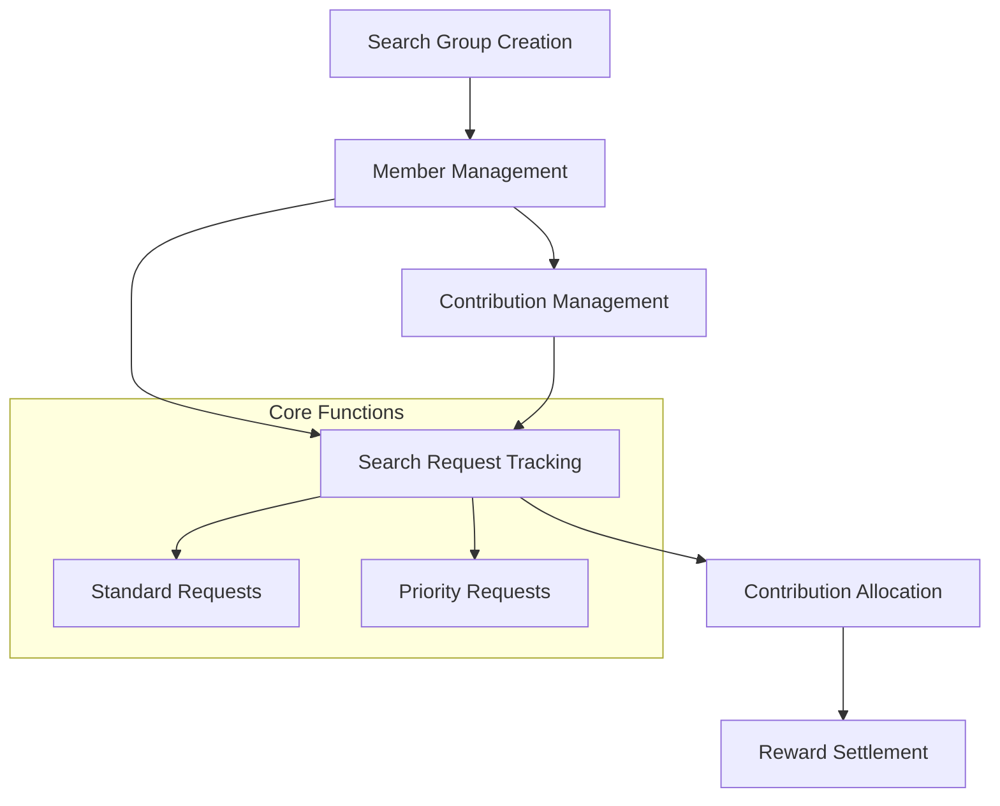

# Sync Search Tool

Sync Search Tool is a decentralized, blockchain-powered platform for collaborative search request management. It enables groups to efficiently coordinate and incentivize search tasks using a transparent, trustless system on the Stacks blockchain.

## Overview

Sync Search Tool allows collaborative groups to:
- Create shared search request groups
- Launch standard and priority search requests
- Manage group memberships
- Track and reward search contributions
- Allocate rewards based on member contributions
- Maintain a transparent search request history

## Architecture

The system is built around a core smart contract that manages group membership, search requests, and contribution tracking. Here's how the components interact:



### Core Components:
- **Search Groups**: Base unit for organizing search collaborations
- **Members**: Individual participants in a search group
- **Search Requests**: Both standard and priority search tasks
- **Contributions**: Member participation tracking
- **Rewards**: Performance-based incentive distribution

## Contract Documentation

### Sync Search Manager Contract (`sync-search-manager.clar`)

The main contract handling search group management and collaborative search operations.

#### Key Features:
- Search group creation and management
- Member addition and contribution tracking
- Search request creation and tracking
- Dynamic contribution allocation
- Reward mechanism design

#### Access Control:
- Group creators have admin privileges
- Members can create and participate in search requests
- Only admins can add/modify members and update contribution allocations

## Getting Started

### Prerequisites
- Clarinet installation
- Stacks wallet for deployment

### Basic Usage

1. Create a search group:
```clarity
(contract-call? .sync-search-manager create-search-group "Research Collective")
```

2. Add members:
```clarity
(contract-call? .sync-search-manager add-member group-id member-address)
```

3. Create a search request:
```clarity
(contract-call? .sync-search-manager create-search-request group-id "Find advanced AI research papers" u500 "priority")
```

## Function Reference

### Group Management

```clarity
(create-search-group (name (string-ascii 100)))
(add-member (group-id uint) (new-member principal))
```

### Search Request Management

```clarity
(create-search-request 
  (group-id uint) 
  (query (string-ascii 200)) 
  (reward-amount uint)
  (request-type (string-ascii 20))
)
```

## Development

### Testing
1. Clone the repository
2. Install dependencies: `clarinet install`
3. Run tests: `clarinet test`

### Local Development
1. Start local chain: `clarinet console`
2. Deploy contracts: `clarinet deploy`

## Security Considerations

### Limitations
- Maximum 20 members per search group
- Reward amounts must be positive integers
- Contribution allocations must sum to 100%

### Best Practices
- Verify member contributions before reward distribution
- Ensure fair contribution allocation
- Validate search request parameters
- Maintain transparent group dynamics

The system enforces validation checks for:
- Authorization and group membership
- Valid search request parameters
- Proper contribution allocation
- Secure group administration